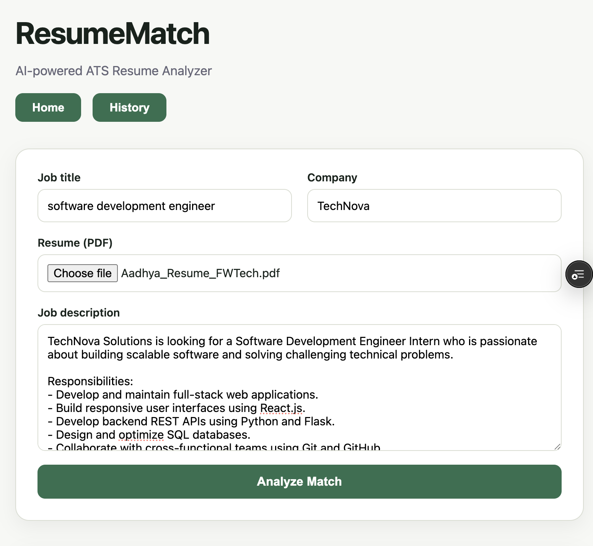
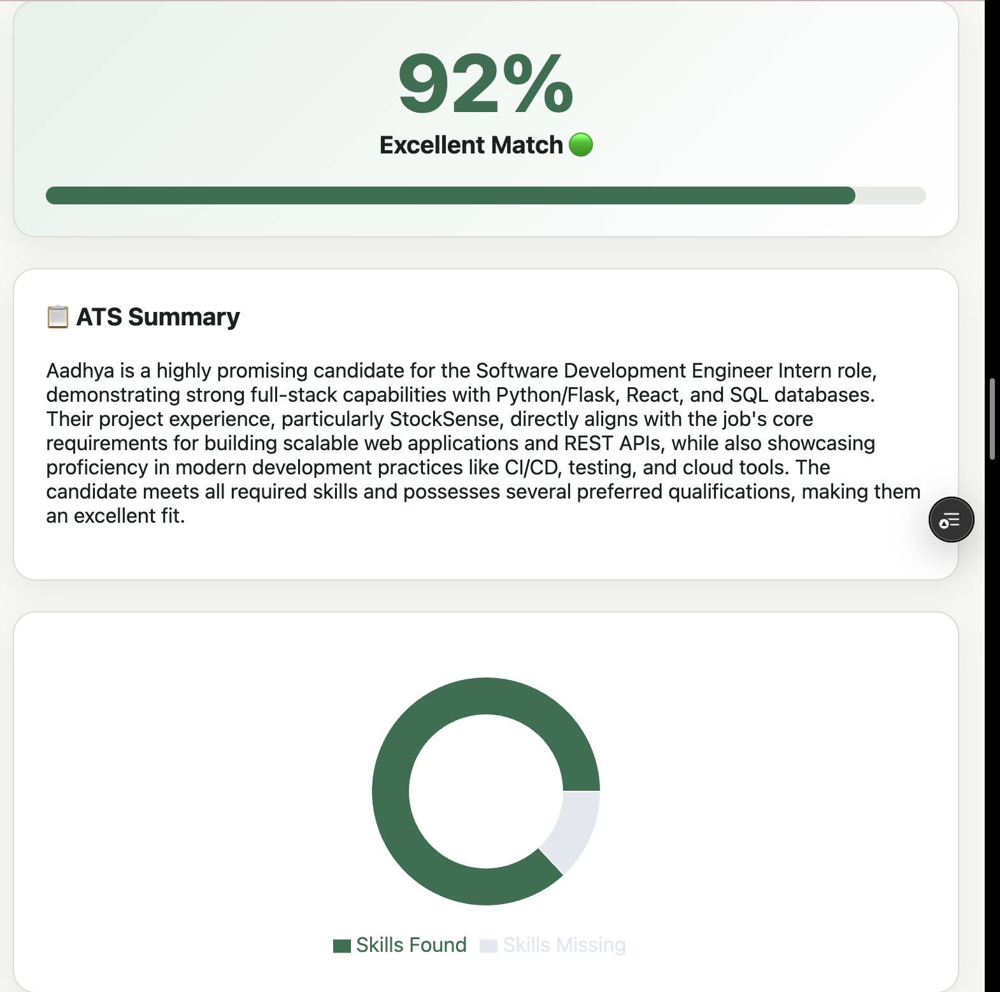
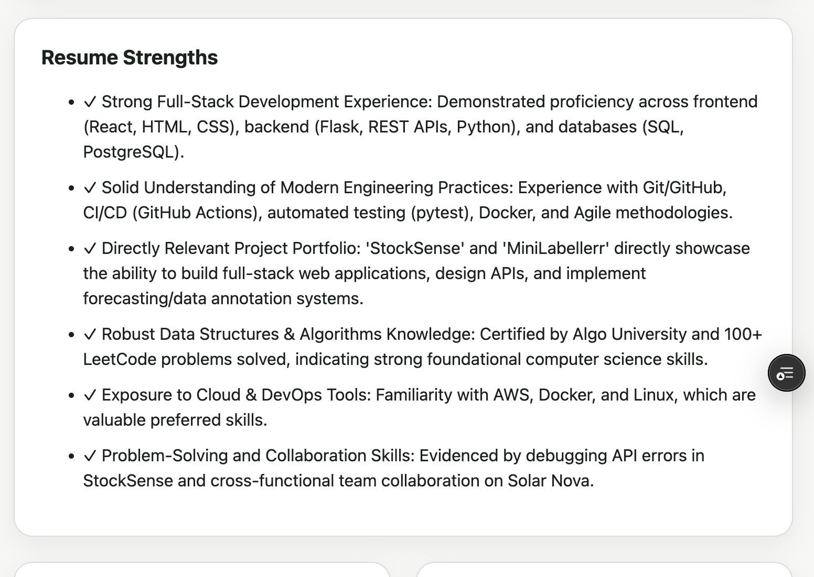
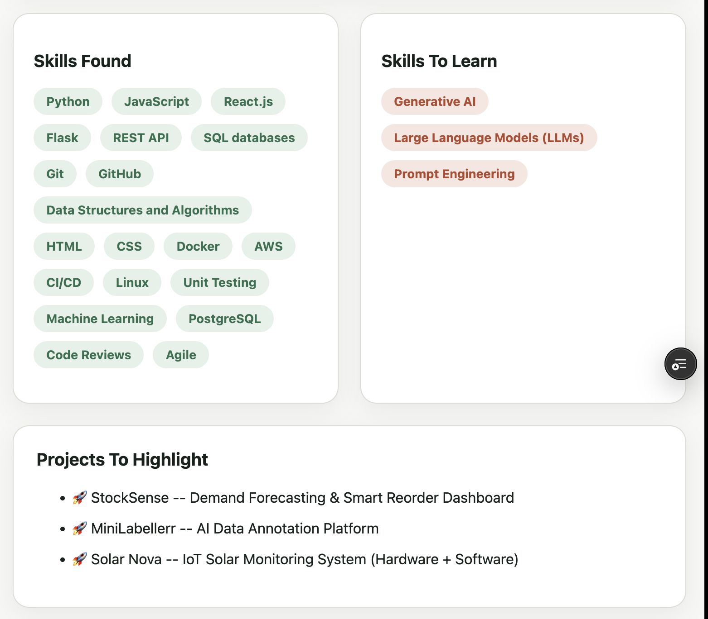
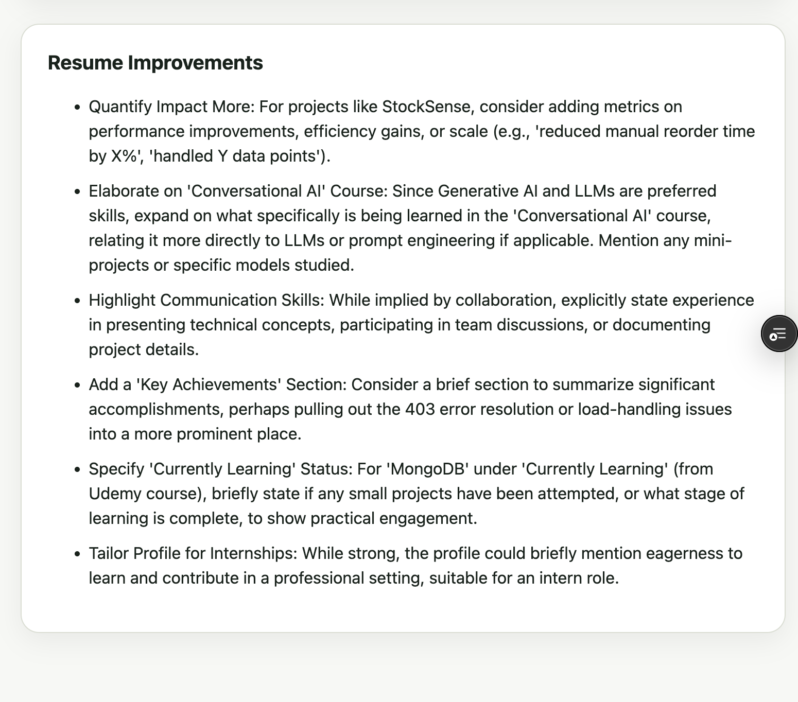
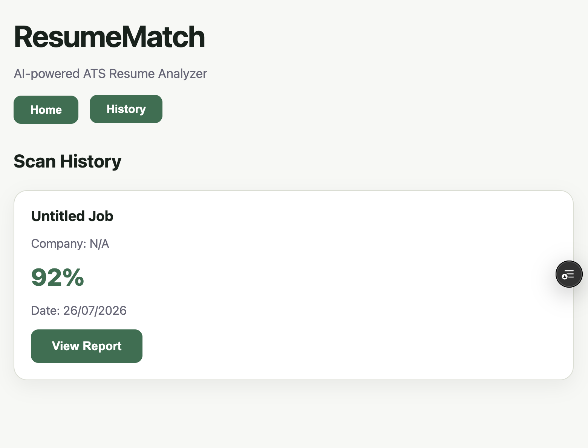

# 🚀 AI Resume Matcher

An AI-powered ATS Resume Analyzer that compares resumes with job descriptions using **Google Gemini AI**. The application generates ATS match scores, identifies strengths and missing skills, provides personalized resume improvement suggestions, and stores scan history.

## 🌐 Live Demo

**Frontend:**  
https://ai-resume-matcher-fawn.vercel.app/

**Backend API:**  
https://resume-matcher-backend-ldt5.onrender.com

---

## ✨ Features

- 📄 Upload PDF resumes
- 🤖 AI-powered resume analysis using Google Gemini
- 🎯 ATS Match Score with visual progress meter
- 📝 ATS Summary
- 💪 Resume Strengths Analysis
- ✅ Skills Found
- 📚 Skills To Learn
- 💡 Personalized Resume Improvement Suggestions
- 📊 Interactive Analytics Dashboard
- 🥧 Skill Distribution Charts (Recharts)
- 🕒 Scan History
- 💾 SQLite Database Integration
- ⚡ Fast React + Flask Architecture
- ☁️ Deployed on Vercel & Render

---

## 🛠 Tech Stack

### Frontend

- React.js
- Vite
- Recharts
- CSS3

### Backend

- Flask
- Flask SQLAlchemy
- SQLite
- Google Gemini API
- PyPDF
- Gunicorn

### AI

- Google Gemini 2.5 Flash

---

## 📸 Screenshots

### 🏠 Home Page



---

### 🎯 ATS Match Score



---

### 💪 Resume Strengths



---

### 🧠 Skills Analysis



---

### 💡 Resume Improvement Suggestions


---

### ✨ Resume Improvements



---

### 📜 Scan History



---

### 📊 AI Analysis Dashboard

> *(Add `screenshots/dashboard.png`.)*

```md

```

---

### 📜 Scan History

> *(Add `screenshots/history.png`.)*

```md

```

---

## 📊 Dashboard Includes

- ATS Match Score
- ATS Summary
- Resume Strengths
- Skills Found
- Skills To Learn
- Resume Improvement Suggestions
- Interactive Skill Chart
- Previous Scan History

---

## 📂 Project Structure

```
AI-Resume-Matcher
│
├── backend
│   ├── app.py
│   ├── routes.py
│   ├── models.py
│   ├── parser.py
│   ├── llm_service.py
│   ├── requirements.txt
│   └── .env.example
│
├── frontend
│   ├── src
│   │   ├── components
│   │   ├── App.jsx
│   │   ├── api.js
│   │   └── index.css
│   ├── package.json
│   └── vite.config.js
│
├── screenshots
│
├── README.md
└── .gitignore
```

---

## ⚙️ Installation

### Clone Repository

```bash
git clone https://github.com/aadhya-code/AI-Resume-Matcher.git

cd AI-Resume-Matcher
```

---

### Backend Setup

```bash
cd backend

python -m venv venv
```

macOS/Linux

```bash
source venv/bin/activate
```

Windows

```bash
venv\Scripts\activate
```

Install dependencies

```bash
pip install -r requirements.txt
```

Create `.env`

```env
GEMINI_API_KEY=YOUR_GEMINI_API_KEY
```

Run backend

```bash
python app.py
```

---

### Frontend Setup

```bash
cd frontend

npm install

npm run dev
```

---

## 🚀 How It Works

1. Upload a PDF resume.
2. Paste the Job Description.
3. Resume text is extracted.
4. Google Gemini compares the resume with the Job Description.
5. AI generates:
   - ATS Match Score
   - ATS Summary
   - Resume Strengths
   - Skills Found
   - Missing Skills
   - Resume Suggestions
6. Scan results are stored in SQLite.
7. Users can revisit previous analyses through Scan History.

---

## 🌍 Deployment

### Frontend

- **Platform:** Vercel

### Backend

- **Platform:** Render

---

## 🔮 Future Improvements

- Download PDF Report
- Authentication & User Accounts
- Multiple Resume Comparison
- Resume Version Tracking
- Dark Mode
- Docker Support
- PostgreSQL Database
- CI/CD Pipeline

---

## 👩‍💻 Author

**Aadhya Garg**

GitHub:  
https://github.com/aadhya-code

---

## 🤝 Contributing

Contributions, suggestions, and improvements are welcome.

1. Fork the repository.
2. Create a new feature branch.
3. Commit your changes.
4. Submit a Pull Request.

---

## 📄 License

This project is licensed under the MIT License.

---

## ⭐ Support

If you found this project helpful, please consider giving it a ⭐ on GitHub!